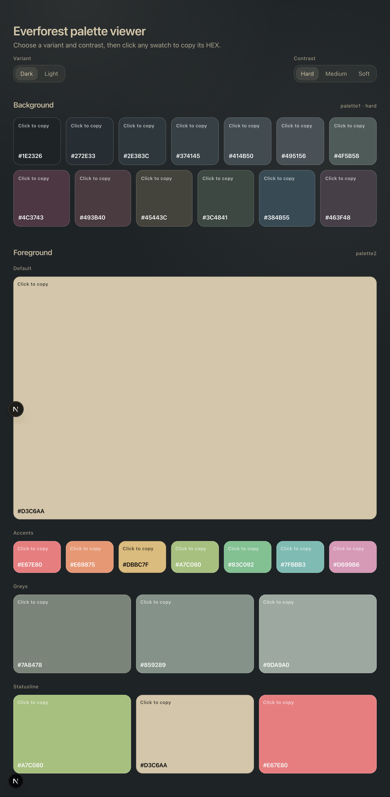
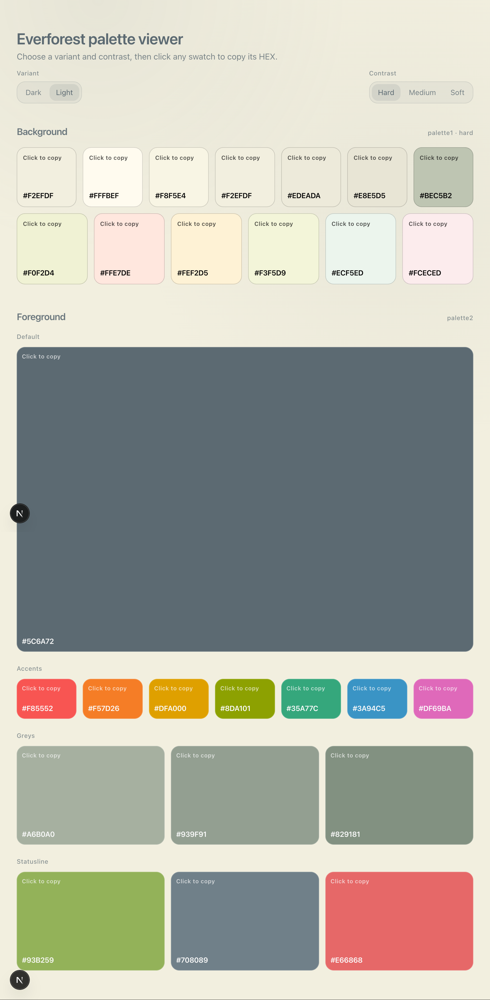

# Everforest Palette Viewer

Browse Everforest palettes in your browser and copy HEX codes with a click.

## Screenshots

<p align="center">
  
  
</p>

## Features

- Toggle **Variant**: Dark / Light
- Toggle **Contrast**: Hard / Medium / Soft (background `palette1`)
- Browse foreground `palette2` groups: Default, Accents, Greys, Statusline
- Click any swatch to copy its HEX (toast confirmation + “Copied” state)
- Keyboard-friendly tabs (use ArrowLeft/ArrowRight)

## Run Locally

### Prerequisites

- Node.js (18+ recommended)
- npm

### Start the dev server

The app reads `palette.md` from **one level above** this Next.js app (i.e. `../palette.md`). If you cloned the full repo, it should already exist.

```bash
cd everforest-palette-viewer
npm install
npm run dev
```

Open `http://localhost:3000`.

### Production build

```bash
npm run build
npm run start
```

## Using the Web App

1. Pick a **Variant** (Dark/Light).
2. Pick a **Contrast** (Hard/Medium/Soft).
3. Click any color swatch to copy its HEX value.
4. A toast will confirm the copy, and the last-copied swatch will display “Copied”.

## Palette Source (`palette.md`)

- Colors are parsed from `../palette.md`.
- The parser extracts hex values from markdown image tags like `![#232A2E]`.
- It reads the `### Dark` and `### Light` sections and stops at `## Highlights`.

## Troubleshooting

- **“Could not load palette”**: ensure `palette.md` exists one level above the Next.js app (repo root). If you moved folders around, update the path logic in `lib/palette.ts`.

## Attribution

Everforest theme and palette are originally from: https://github.com/sainnhe/everforest
